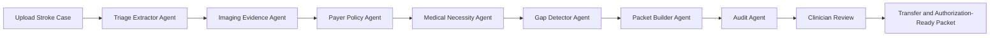
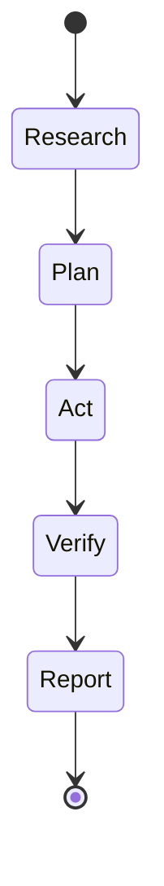
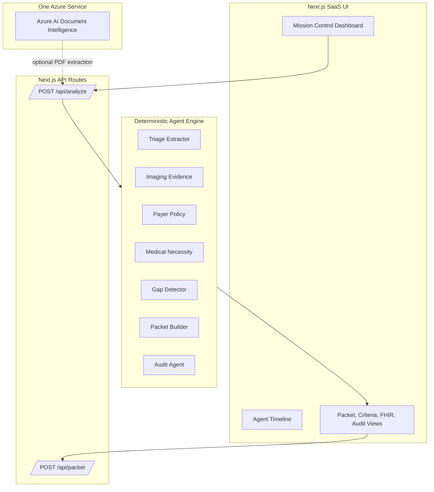
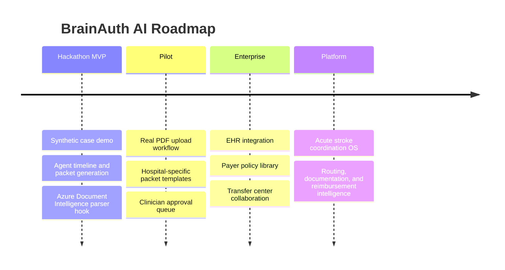

# BrainAuth AI

**Prior Auth Before Brain Dies**

BrainAuth AI is an autonomous documentation and prior-authorization readiness agent for acute stroke teams. It does **not** delay emergency screening or stabilization. It automates the documentation, medical-necessity proof, transfer packet, payer criteria mapping, and audit-ready workflow around acute stroke care.

## Why This Wins The Hackathon

The demo is built around the judging rubric: a working MVP, visible agentic AI behavior, startup-grade positioning, strong UX, technical feasibility, and a clear future plan. The product feels like AI mission control instead of a form.

The live demo shows a rural hospital preparing a transfer and thrombectomy-readiness packet for a suspected large-vessel ischemic stroke case. BrainAuth AI extracts the key facts, checks payer criteria, identifies missing documentation, generates a medical necessity letter, builds FHIR-style JSON, exports a PDF packet, and records an audit trail for every agent step.

## Core Caveat

Do not pitch this as "prior auth blocks emergency stroke treatment."

Use this framing:

> BrainAuth AI does not delay emergency stabilization. It automates the documentation, medical-necessity proof, transfer packet, and authorization-ready workflow around acute stroke care so clinicians do not lose time chasing paperwork while the patient's brain is dying.

This caveat matters because EMTALA requires emergency screening and stabilizing treatment regardless of ability to pay.

## MVP Features

- Agentic workflow with seven named agents.
- Live agent timeline with Research -> Plan -> Act -> Verify -> Report phases.
- Synthetic EHR, CT/CTA report, transfer note, and payer policy case data.
- Payer criteria match with confidence scores.
- Missing documentation checklist and gap resolution loop.
- Medical necessity letter generation.
- FHIR-style JSON packet generation.
- PDF packet export through `/api/packet`.
- Audit trail with every extraction, decision, confidence score, and missing field.
- Source-backed impact metrics for the pitch.
- Azure AI Document Intelligence integration hook with local deterministic fallback.

## Quickstart

```bash
npm install
npm run dev
```

Open:

```text
http://localhost:3000
```

Run checks:

```bash
npm run typecheck
npm run build
```

## Demo Flow

1. Click **Run Stroke Packet**.
2. Watch the agent activity stream.
3. Show the "neurons at risk avoided" counter.
4. Open the Criteria, FHIR JSON, and Audit tabs.
5. Show the critical missing medication history gap.
6. Click **Attach Medication History**.
7. Watch the packet regenerate with a higher readiness score.
8. Download the PDF packet.

## Product Definition

BrainAuth AI takes:

- Synthetic EHR note
- CT/CTA report
- NIHSS score
- Last-known-well time
- Medication history
- Transfer note
- Payer policy PDF

BrainAuth AI outputs:

- Structured clinical facts
- Payer criteria match
- Missing documentation checklist
- Medical necessity letter
- FHIR-style JSON packet
- Prior-auth / transfer-ready PDF
- Audit log showing every agent step

## Agent Workflow



Every agent follows the same loop:



## Architecture



## Azure AI Document Intelligence

This project intentionally uses only one Azure service: **Azure AI Document Intelligence**. Microsoft lists a free tier with 0-500 pages free per month for Document Intelligence. The current MVP runs without Azure credentials using deterministic synthetic extraction, but the adapter is ready in `lib/azureDocumentIntelligence.ts`.

Set these environment variables to enable the Azure-ready path:

```bash
AZURE_DOCUMENT_INTELLIGENCE_ENDPOINT="https://<resource>.cognitiveservices.azure.com"
AZURE_DOCUMENT_INTELLIGENCE_KEY="<key>"
```

The adapter uses the prebuilt layout model to extract text, tables, and key-value structure from PDFs. In a production build, uploaded EHR, CTA, transfer, and payer policy PDFs would be routed through this parser before the agent engine.

## Data Sources

- CDC Stroke Facts: https://www.cdc.gov/stroke/data-research/facts-stats/index.html
- WHO Stroke Fact Sheet: https://www.who.int/news-room/fact-sheets/detail/stroke
- Saver, "Time is brain - quantified": https://pubmed.ncbi.nlm.nih.gov/16339467/
- AMA Prior Authorization Survey: https://www.ama-assn.org/system/files/prior-authorization-survey.pdf
- CMS EMTALA: https://www.cms.gov/medicare/regulations-guidance/legislation/emergency-medical-treatment-labor-act
- Azure Document Intelligence Pricing: https://azure.microsoft.com/en-us/pricing/details/document-intelligence/
- World Stroke Organization Impact: https://www.world-stroke.org/world-stroke-day-campaign/about-stroke/impact-of-stroke
- WSO Global Stroke Fact Sheet 2025: https://pubmed.ncbi.nlm.nih.gov/39635884/

## Future Plan



## Compliance Positioning

BrainAuth AI is a clinician-reviewed documentation tool. It does not diagnose, treat, deny care, approve care, or delay emergency stabilization. It prepares evidence packets and flags missing documentation so clinicians and transfer teams can move faster with a clearer audit trail.
