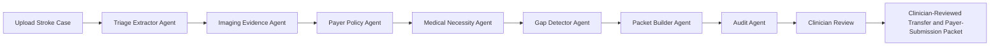
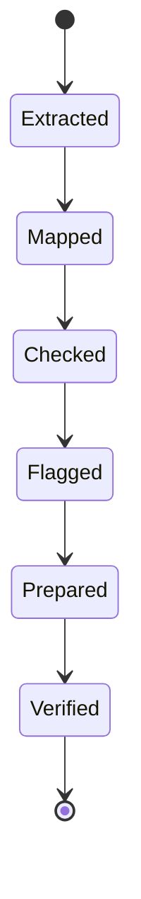
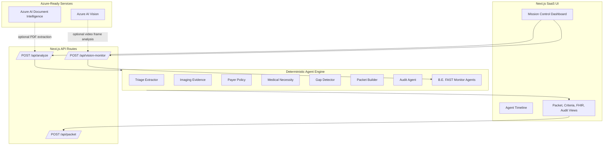

# BrainAuth AI

**Prior Auth Before Brain Dies**

BrainAuth AI is a clinician-reviewed documentation support tool for acute stroke transfer and payer-submission workflows. It does **not** delay emergency screening or stabilization. It automates documentation evidence, medical-necessity draft support, transfer packet assembly, payer criteria mapping, and audit trails around acute stroke care.

## Why This Wins The Hackathon

The demo is built around the judging rubric: a working MVP, visible agentic AI behavior, startup-grade positioning, strong UX, technical feasibility, and a clear future plan. The product feels like AI mission control instead of a form.

The live demo shows a rural hospital preparing a transfer and thrombectomy-readiness packet for a suspected large-vessel ischemic stroke case. BrainAuth AI extracts the key facts, checks payer criteria, identifies missing documentation, generates a medical necessity letter, builds FHIR-style JSON, exports a PDF packet, and records an audit trail for every agent step.

## Core Caveat

Do not pitch this as "prior auth blocks emergency stroke treatment."

Use this framing:

> BrainAuth AI does not delay emergency stabilization. It automates the documentation, medical-necessity proof, transfer packet, and payer-submission documentation workflow around acute stroke care so clinicians do not lose time chasing paperwork while the patient's brain is at risk.

This caveat matters because EMTALA requires emergency screening and stabilizing treatment regardless of ability to pay.

## MVP Features

- Agentic workflow with seven named agents.
- Live agent timeline with Extracted -> Mapped -> Checked -> Flagged -> Prepared -> Verified action states.
- Synthetic EHR, CT/CTA report, transfer note, and payer policy case data.
- Payer criteria match with confidence scores.
- Missing documentation checklist and gap resolution loop.
- Medical necessity letter generation.
- FHIR-style JSON packet generation.
- PDF/TXT packet export through `/api/export/demo-packet/pdf`, `/api/export/demo-packet/text`, and legacy `/api/packet`.
- Audit trail with every extracted fact, source, confidence score, and missing field.
- Source-backed impact metrics for the pitch.
- Azure AI Document Intelligence integration hook with local deterministic fallback.
- Embedded synthetic EHR PDF viewer and open-source PDF ingestion fallback for the live demo.
- B.E. FAST video monitoring extension with upload preview, Azure AI Vision-ready frame analysis, EHR context fusion, care-circle alert simulation, and emergency-first safety language.

## Quickstart

```bash
npm install
npm run dev
```

Open:

```text
http://localhost:3000
```

Regenerate the synthetic one-page EHR PDF:

```bash
npm run generate:demo-pdf
```

Run checks:

```bash
npm run typecheck
npm run build
```

## Demo Flow

1. Click **Run Stroke Packet**.
2. Watch the embedded PDF ingest with Azure-aware parsing or the `pdf-parse` fallback.
3. Watch the agent activity stream.
4. Show the "neurons at risk avoided" counter.
5. Open Packet Preview, Criteria Matrix, Evidence, collapsed Audit Trail, and collapsed FHIR JSON.
6. Show the critical missing medication history gap.
7. Click **Attach Medication History**.
8. Watch the packet regenerate with a higher readiness score.
9. Download the PDF packet.

## B.E. FAST Monitor Demo Flow

1. Scroll to **B.E. FAST Monitoring Agent**.
2. Upload a symptom video or click **Use Demo Clip**.
3. Click **Run B.E. FAST Monitor**.
4. Watch the staged video-frame agents sample the stream, score B.E. FAST signals, fuse EHR context, and prepare escalation actions.
5. Show the automated action buttons:
   - Emergency prompt
   - Loved one notification
   - Urgent stroke clinician callback
   - Monitoring audit
6. Explain the safety posture: this is not a diagnosis; sudden stroke symptoms require immediate emergency medical attention.

## Product Definition

BrainAuth AI takes:

- Synthetic EHR note
- CT/CTA report
- NIHSS score
- Last-known-well time
- Medication history
- Transfer note
- Payer policy PDF

BrainAuth AI outputs:

- Structured clinical facts
- Payer criteria match
- Missing documentation checklist
- Medical necessity letter
- FHIR-style JSON packet
- Clinician-review transfer and payer-submission PDF draft
- Audit log showing every agent step

## Agent Workflow



Every agent follows the same loop:



## Architecture



## Azure Integrations

BrainAuth AI has two Azure-ready integration points. The live MVP remains deterministic if credentials are unavailable.

### Azure AI Document Intelligence

Azure AI Document Intelligence parses EHR PDFs, CTA reports, transfer notes, and payer policy documents. The current MVP runs without Azure credentials using deterministic synthetic extraction and the open-source `pdf-parse` fallback, but the adapter is ready in `lib/azureDocumentIntelligence.ts`.

Set these environment variables to enable the Azure-ready path:

```bash
AZURE_DOCUMENT_INTELLIGENCE_ENDPOINT="https://<resource>.cognitiveservices.azure.com"
AZURE_DOCUMENT_INTELLIGENCE_KEY="<key>"
```

The adapter uses the prebuilt layout model to extract text, tables, and key-value structure from PDFs. In a production build, uploaded EHR, CTA, transfer, and payer policy PDFs would be routed through this parser before the agent engine.

### Azure AI Vision / Computer Vision

Azure AI Vision is the current Azure service family for visual analysis. The B.E. FAST monitor route at `/api/vision-monitor` is Azure-ready and falls back to deterministic local video-frame findings when credentials are missing.

```bash
AZURE_AI_VISION_ENDPOINT="https://<resource>.cognitiveservices.azure.com"
AZURE_AI_VISION_KEY="<key>"
```

The production path samples frames from a live or uploaded video stream, submits selected frames to Azure AI Vision, then fuses frame findings with EHR context and care-circle routing. The hackathon path keeps those outputs deterministic for a reliable live demo.

## Data Sources

- CDC Stroke Facts: https://www.cdc.gov/stroke/data-research/facts-stats/index.html
- WHO Stroke Fact Sheet: https://www.who.int/news-room/fact-sheets/detail/stroke
- Saver, "Time is brain - quantified": https://pubmed.ncbi.nlm.nih.gov/16339467/
- AMA Prior Authorization Survey: https://www.ama-assn.org/system/files/prior-authorization-survey.pdf
- CMS EMTALA: https://www.cms.gov/medicare/regulations-guidance/legislation/emergency-medical-treatment-labor-act
- Azure Document Intelligence Pricing: https://azure.microsoft.com/en-us/pricing/details/document-intelligence/
- Azure AI Vision documentation: https://learn.microsoft.com/en-us/azure/ai-services/computer-vision/
- Azure near-real-time video frame analysis: https://learn.microsoft.com/en-us/azure/ai-services/computer-vision/how-to/analyze-video
- World Stroke Organization Impact: https://www.world-stroke.org/world-stroke-day-campaign/about-stroke/impact-of-stroke
- WSO Global Stroke Fact Sheet 2025: https://pubmed.ncbi.nlm.nih.gov/39635884/

## Future Plan


## Compliance Positioning

BrainAuth AI is a clinician-reviewed documentation tool. It does not diagnose, treat, deny care, approve care, or delay emergency stabilization. It prepares evidence packets and flags missing documentation so clinicians and transfer teams can move faster with a clearer audit trail.
