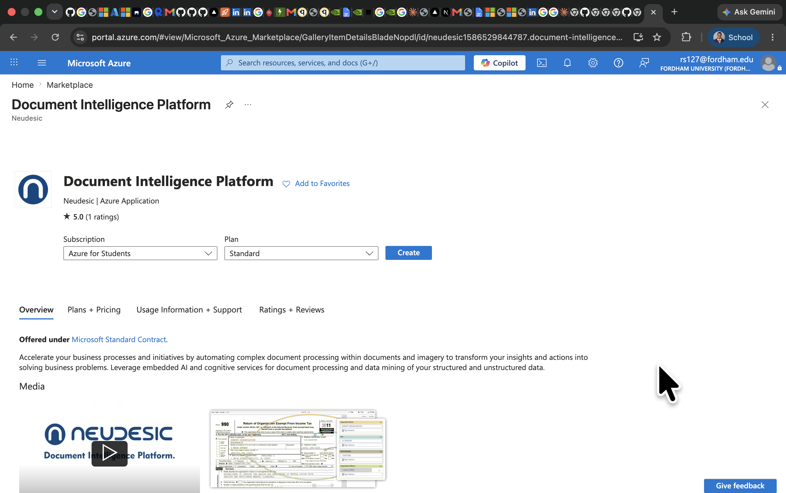
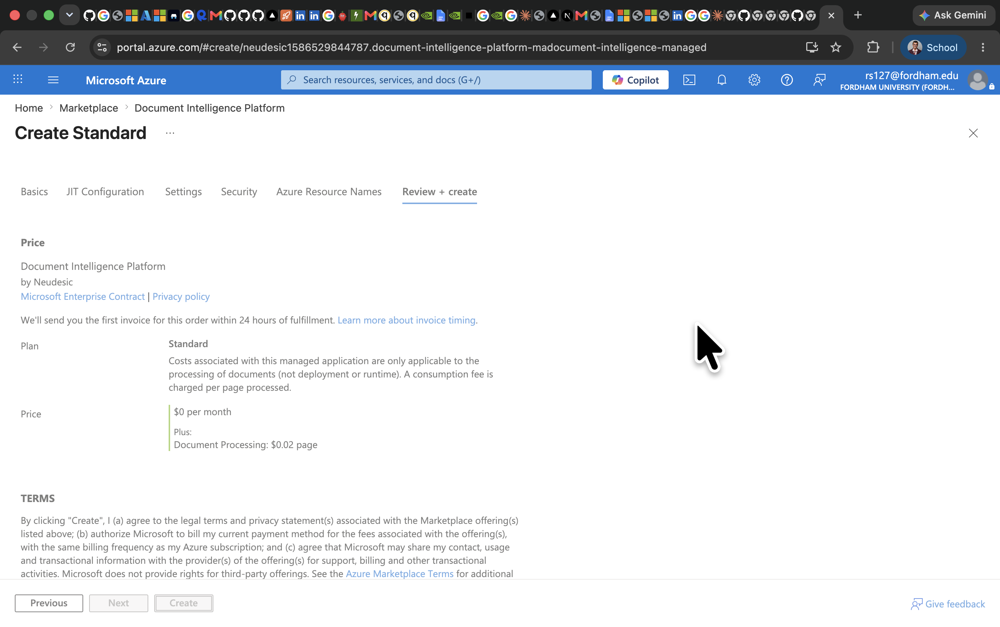

# Azure Document Intelligence Evidence

These screenshots show the Azure Document Intelligence Platform workflow explored for the BrainAuth AI technical stack.

## Marketplace Listing



## Review And Create



## How This Maps To BrainAuth AI

BrainAuth AI is built around document ingestion:

1. View a synthetic EHR PDF inside `/demo`.
2. Ingest the PDF through `/api/ingest-demo-pdf`.
3. If Azure Document Intelligence credentials exist, the route attempts Azure parsing.
4. If credentials are unavailable, the route uses the open-source `pdf-parse` fallback.
5. The agent workflow consumes extracted fields and prepares the source-grounded packet draft.

This keeps the demo reliable while preserving a realistic production path:

```mermaid
flowchart LR
  PDF[Synthetic EHR PDF] --> Route[/api/ingest-demo-pdf]
  Route --> Azure{Azure DI configured?}
  Azure -->|Yes| DI[Azure AI Document Intelligence]
  Azure -->|No| Local[pdf-parse local parser]
  DI --> Facts[Extracted clinical fields]
  Local --> Facts
  Facts --> Agents[BrainAuth agents]
  Agents --> Packet[Clinician-review packet draft]
```

## Demo Artifact

The generated PDF used in the MVP is:

```text
public/demo/brainauth-stroke-demo-record.pdf
```

Regenerate it with:

```bash
npm run generate:demo-pdf
```
