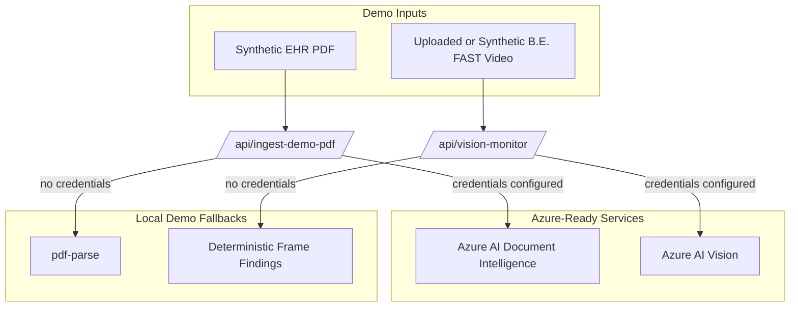

# Azure Usage

## Services

BrainAuth AI has two Azure-ready integration points:

1. **Azure AI Document Intelligence** for PDFs and forms.
2. **Azure AI Vision** for B.E. FAST video-frame analysis.

The hackathon demo remains reliable without Azure credentials. When credentials are missing, the app truthfully labels local deterministic fallback mode.

## System Diagram



## Document Intelligence

Purpose:

- Parse EHR packet PDFs.
- Parse CT/CTA reports.
- Parse payer policy PDFs.
- Preserve confidence scores for source-grounded claims.

Environment variables:

```bash
AZURE_DOCUMENT_INTELLIGENCE_ENDPOINT="https://<resource>.cognitiveservices.azure.com"
AZURE_DOCUMENT_INTELLIGENCE_KEY="<key>"
```

Routes:

```text
GET  /api/azure-document
POST /api/azure-document
GET  /api/ingest-demo-pdf
```

Fallback behavior:

- Without credentials, `/api/ingest-demo-pdf` uses `pdf-parse`.
- With credentials, `/api/ingest-demo-pdf` attempts Azure AI Document Intelligence first and falls back locally if Azure fails.
- Azure is never shown as connected unless credentials exist.

## Azure AI Vision

Purpose:

- Sample frames from an uploaded or live video stream.
- Analyze visual features relevant to B.E. FAST monitoring.
- Combine vision findings with EHR context and escalation agents.

Environment variables:

```bash
AZURE_AI_VISION_ENDPOINT="https://<resource>.cognitiveservices.azure.com"
AZURE_AI_VISION_KEY="<key>"
```

Legacy-compatible variable names also work:

```bash
AZURE_COMPUTER_VISION_ENDPOINT="https://<resource>.cognitiveservices.azure.com"
AZURE_COMPUTER_VISION_KEY="<key>"
```

Route:

```text
POST /api/vision-monitor
```

Fallback behavior:

- Without credentials, `/api/vision-monitor` returns deterministic B.E. FAST demo findings.
- With credentials, the route reports Azure AI Vision configured.
- The current MVP does not make diagnostic claims; it prepares emergency-first escalation actions.

## Judge Screenshot Checklist

- Azure portal resource page for Document Intelligence.
- Azure portal resource page for Azure AI Vision or Computer Vision.
- `.env.local` showing variable names only, with values hidden.
- `/api/azure-document` response showing configured mode if credentials exist.
- `/api/vision-monitor` response showing configured mode if credentials exist.
- Live app badges:
  - Local parser demo mode or Azure Document Intelligence connected.
  - Azure AI Vision-ready or Azure AI Vision configured.

## Current Evidence Assets

Document Intelligence screenshots are stored here:

```text
docs/AZURE_DOCUMENT_INTELLIGENCE_EVIDENCE.md
docs/assets/azure-document-intelligence/azure-document-intelligence-marketplace.png
docs/assets/azure-document-intelligence/azure-document-intelligence-review-create.png
```

## Official References

- Azure AI Vision documentation: https://learn.microsoft.com/en-us/azure/ai-services/computer-vision/
- Azure near-real-time video frame analysis: https://learn.microsoft.com/en-us/azure/ai-services/computer-vision/how-to/analyze-video
- Azure AI Document Intelligence pricing: https://azure.microsoft.com/en-us/pricing/details/document-intelligence/
