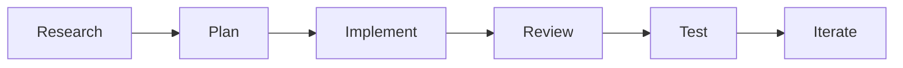

# Copilot-Assisted Build Log

## How GitHub Copilot Is Used

GitHub Copilot is treated as an AI pair programmer for implementation, refactoring, documentation, and review prompts. BrainAuth AI keeps the generated work bounded by repo-level instructions, deterministic demo data, source-grounding rules, and clinician-review safety language.

## Prompting Strategy

The build workflow follows this pattern:

## Planned Proof Artifacts For Judges

- `.github/copilot-instructions.md`
- `docs/COPILOT_BUILD_LOG.md`
- `docs/PROMPTS_USED.md`
- `docs/FINAL_QA.md`
- Atomic conventional commits
- Copilot-assisted build page inside the app
- Optional PR summary if the repo is presented through a pull request

## Initial Prompt Themes

- Convert the MVP from a dark dashboard into a light clinical SaaS.
- Add a landing page and keep the deterministic live demo reliable.
- Add source-grounded schemas and agent action traces.
- Add Azure Document Intelligence fallback behavior.
- Document hallucination safety, agent design, and the demo script.

## Accuracy Guardrails

- Do not claim Copilot built code it did not build.
- Use "Copilot-assisted build" language.
- Keep clinical outputs as drafts requiring physician review.
