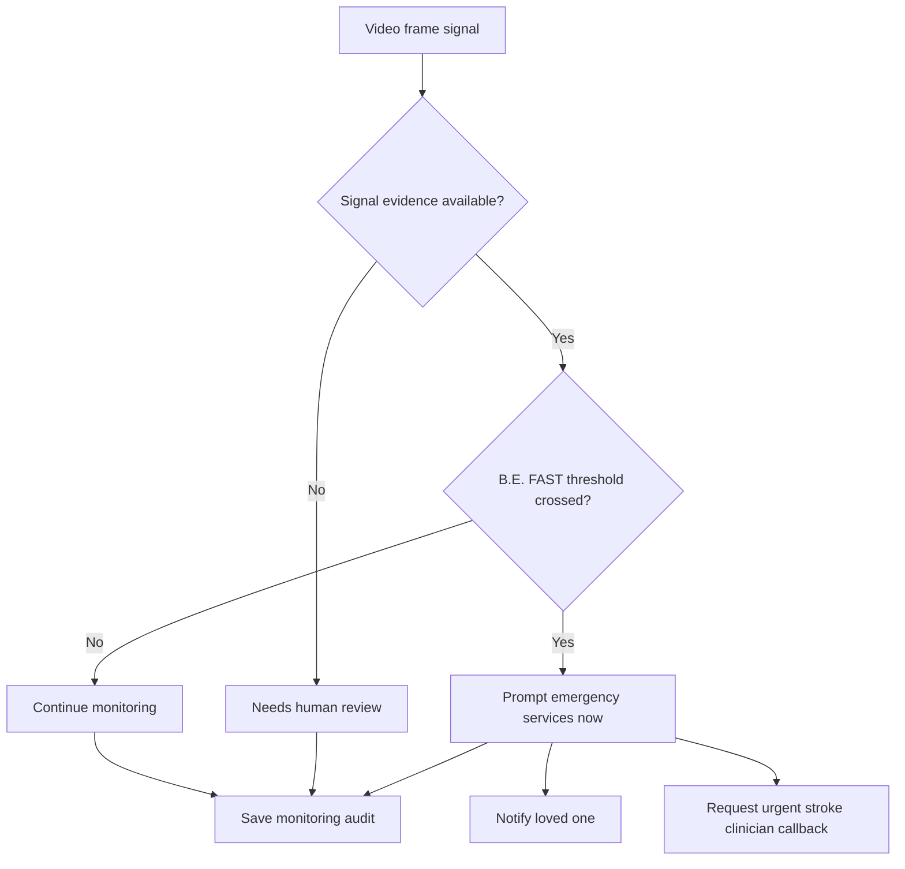

# Hallucination Safety

BrainAuth AI is designed around source-grounded documentation. It does not generate clinical conclusions without source evidence.

## Rules

```text
No source quote -> do not include as a clinical fact.
Conflicting values -> mark conflict.
Confidence < 0.85 -> needs human review.
Missing field -> documentation gap, not hallucinated value.
Packet claim without evidence -> blocked as unsupported.
Physician review required before submission.
Vision finding without frame/context evidence -> mark needs review.
Sudden B.E. FAST symptoms -> emergency-first prompt, not routine appointment.
```

## Source Evidence Shape

```ts
{
  id: "evidence-nihss",
  documentId: "ehr-note-001",
  documentTitle: "Emergency Department Stroke Note",
  sourcePage: 1,
  sourceQuote: "NIHSS documented as 18 on arrival.",
  confidence: 0.96
}
```

## Visible Safety Metrics

- Unsupported claims
- Evidence coverage
- Human review items
- Documents parsed
- Criteria matched
- Gaps found
- B.E. FAST alert score
- Signal confidence bars
- Emergency-first action audit

## Monitoring Safety Flow



## Clinical Boundary

BrainAuth AI does not diagnose, order treatment, approve care, deny care, replace clinicians, or delay emergency stabilization. It prepares documentation drafts, monitoring alerts, and care-circle action drafts for human review and emergency-first response.
