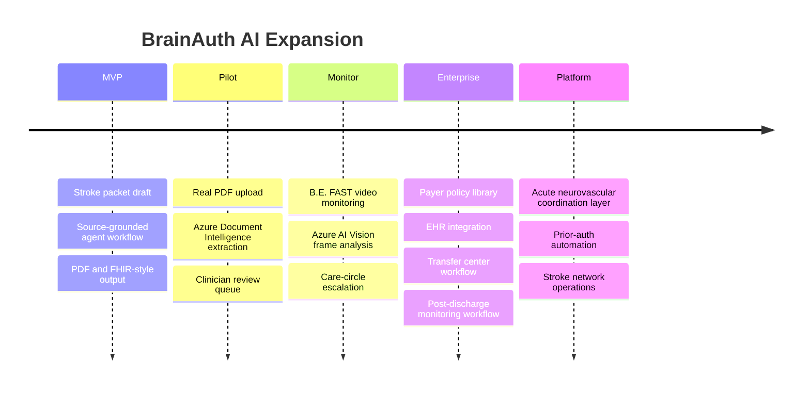

# Startup Story

## Beachhead

Acute stroke transfer and payer-submission documentation packets.

## Buyer

- Comprehensive stroke centers
- Hospital networks
- Transfer centers
- Revenue cycle and prior-authorization teams
- Stroke program leadership

## Why Now

Stroke care is time-critical, payer documentation burden is high, and document extraction plus agentic workflows can now produce source-grounded packet drafts reliably enough for clinician review.

## Expansion

## Long-Term Vision

BrainAuth starts as the documentation wedge, expands into B.E. FAST monitoring and emergency-first escalation, then becomes an operating layer for acute neurovascular care coordination.
