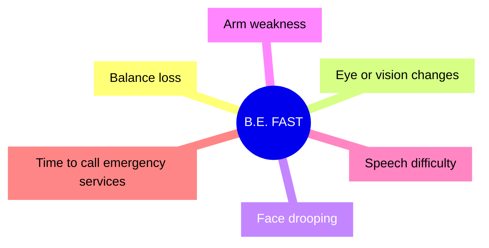
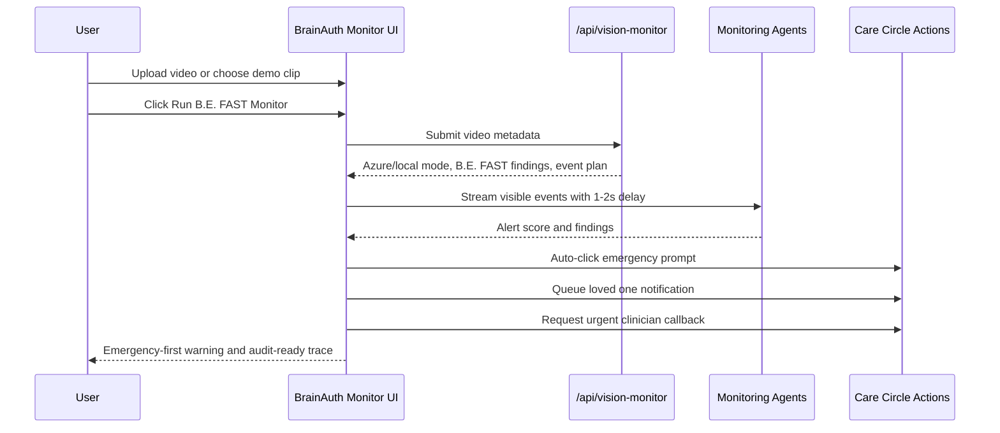
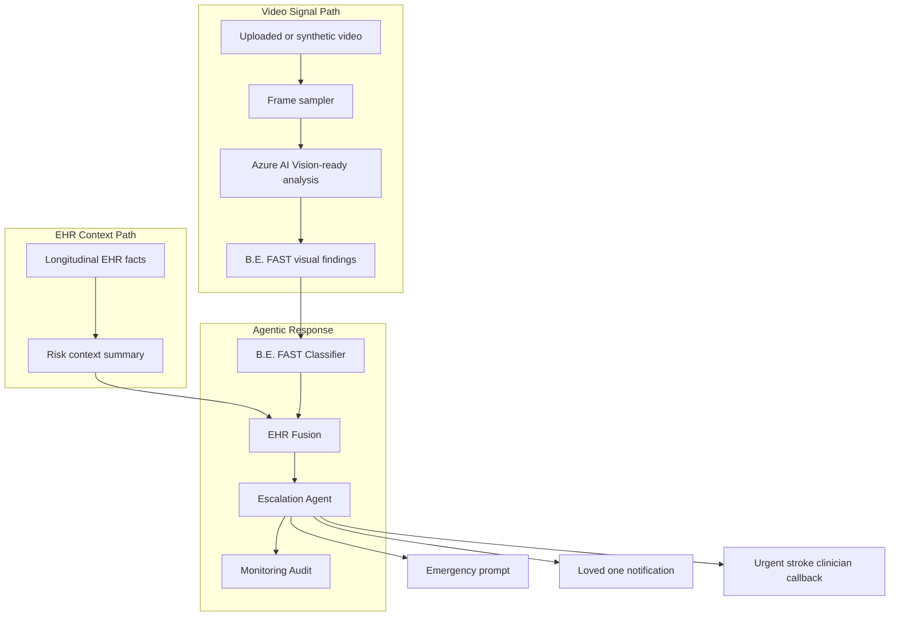
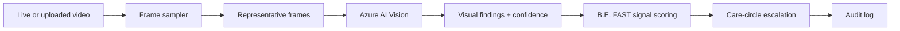
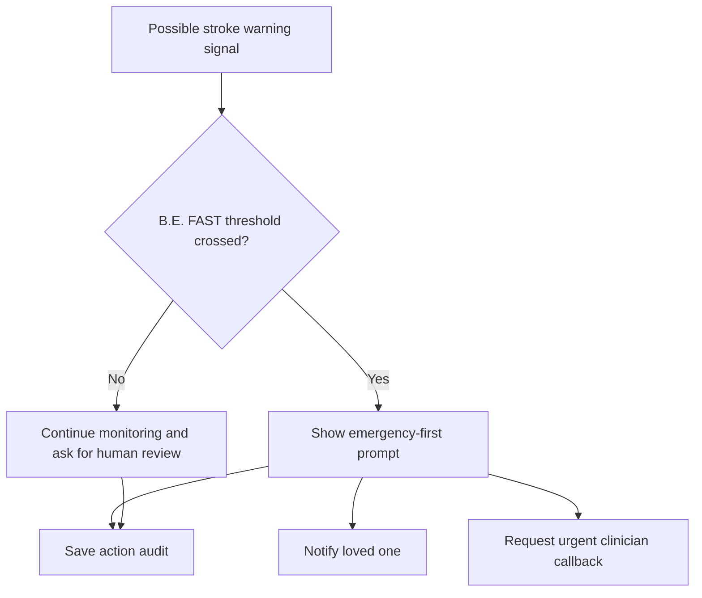

# B.E. FAST Monitoring Extension

## Product Intent

The B.E. FAST monitor is a BrainAuth AI extension for pre-monitoring and post-monitoring patients who may show sudden stroke warning symptoms.

It does not diagnose stroke. It watches for B.E. FAST warning signals, fuses them with EHR context, and prepares emergency-first actions:

- Call emergency services now.
- Notify the care circle.
- Request urgent stroke clinician callback.
- Save an audit trail.

## B.E. FAST Signals



## Demo Flow



## Agent Design



## Azure AI Vision Path

The MVP route `/api/vision-monitor` checks for:

```bash
AZURE_AI_VISION_ENDPOINT
AZURE_AI_VISION_KEY
```

or legacy-compatible names:

```bash
AZURE_COMPUTER_VISION_ENDPOINT
AZURE_COMPUTER_VISION_KEY
```

If credentials exist, the UI reports **Azure AI Vision configured**. If not, it reports **Local vision demo mode** and uses deterministic findings for reliability.

Production implementation:



## Safety Rules



Rules:

- Do not claim diagnosis.
- Do not tell the user to wait for a normal appointment if sudden symptoms are present.
- Use emergency-first copy: call emergency services now.
- Treat Azure output as one signal, not the final decision.
- Record confidence, missing signals, and human review requirements.

## User Experience

The section is intentionally placed below the packet workflow because it is an expansion product:

1. Current wedge: acute stroke packet readiness.
2. Expansion: home/post-discharge B.E. FAST monitoring.
3. Platform: acute neurovascular coordination OS.

The UI uses:

- A visible upload button.
- A demo clip option for reliable judging.
- Live video-style overlays.
- B.E. FAST tiles.
- Agent events with staged delays.
- Big alert score.
- Auto-clicked care actions.
- Safety caveat.
