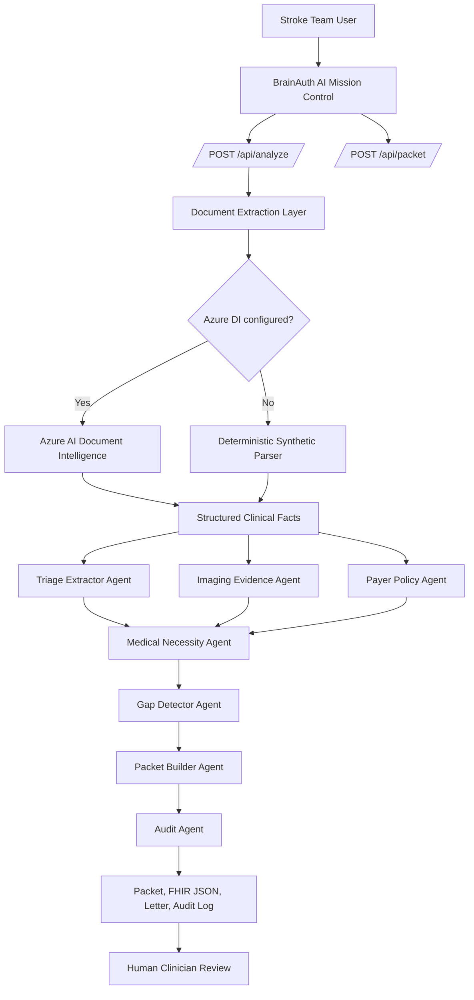
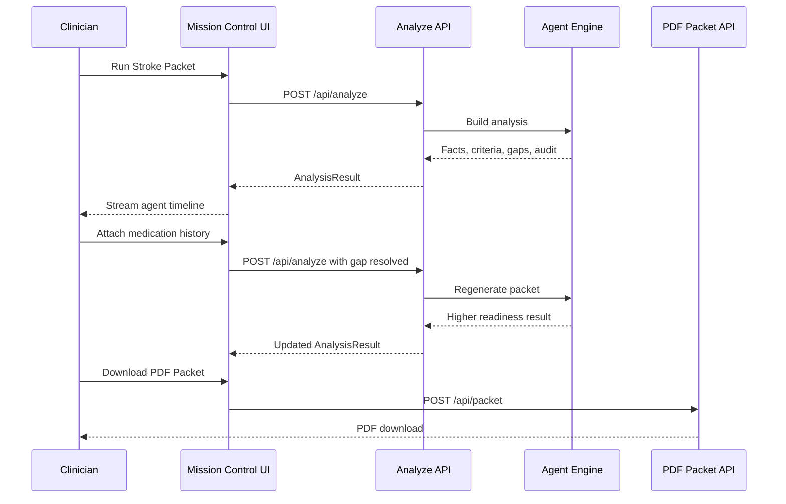
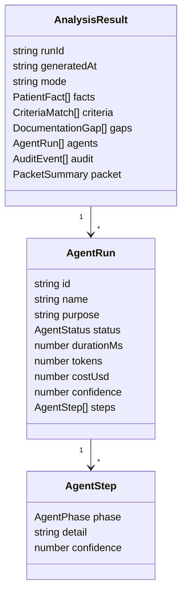

# BrainAuth AI Architecture

## System Map

## Packet Lifecycle

## Agent Contracts

## Why One Azure Service

Azure AI Document Intelligence is the most directly relevant Azure service for this product because it extracts structured text, tables, selection marks, and key-value data from PDFs/forms. That maps to payer policy PDFs, EHR packets, CTA reports, insurance cards, and transfer forms.
