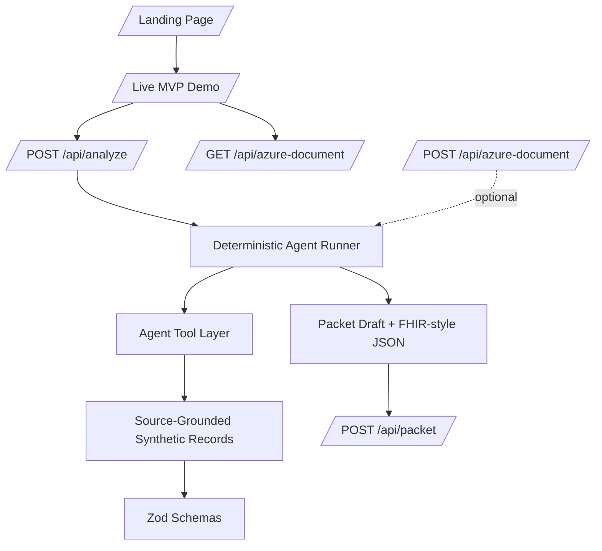
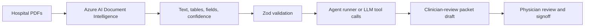

# BrainAuth AI Architecture

## System Overview

BrainAuth AI is a Next.js full-stack MVP with deterministic TypeScript agents, Zod-validated contracts, source-grounded synthetic records, optional Azure AI Document Intelligence parsing, and PDF packet export.

## Frontend Stack

- Next.js App Router
- React
- TypeScript
- Recharts for the time-is-brain graph
- Framer Motion for restrained landing animation
- lucide-react icons
- CSS design tokens for a light clinical SaaS theme

## Runtime Contracts

Zod schemas validate:

- Source documents
- Source evidence
- Clinical facts
- Policy criteria
- Criteria matches
- Documentation gaps
- Agent steps and events
- Audit entries
- Observability metrics
- Packet output

## Production Path

The hackathon demo uses deterministic local extraction so the live presentation is reliable.
