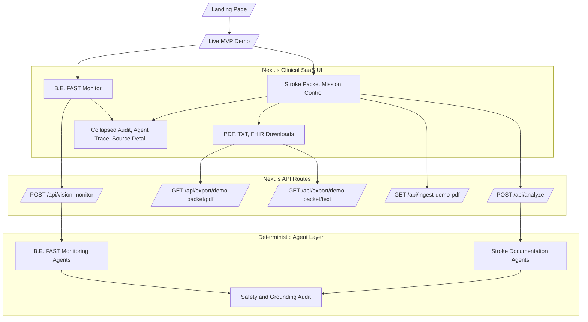
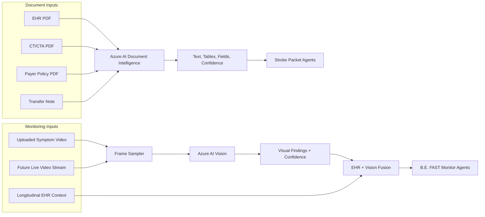
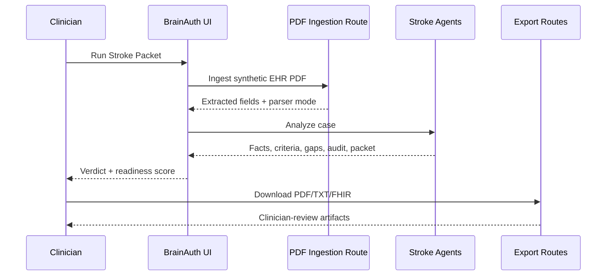
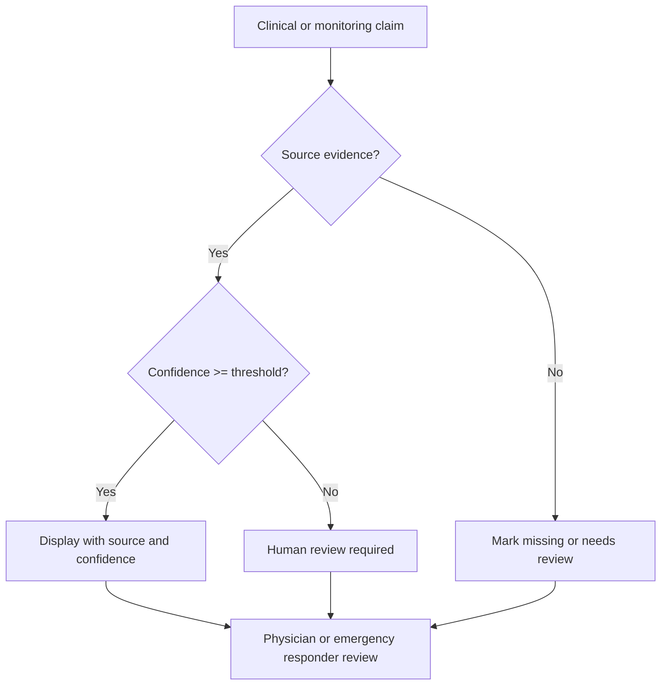
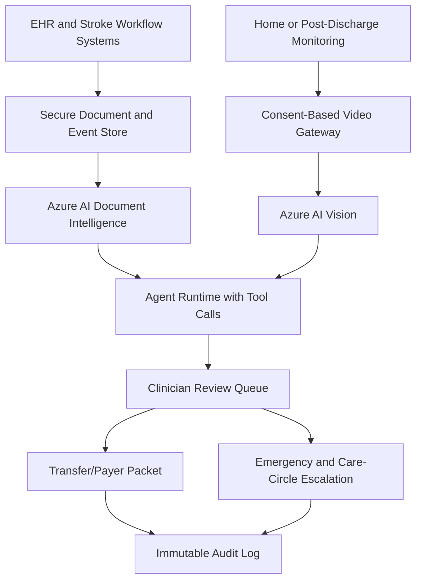

# BrainAuth AI Architecture

## System Overview

BrainAuth AI is a Next.js full-stack MVP with two visible product lanes:

- **Stroke packet readiness:** source-grounded documentation, payer criteria mapping, medical necessity drafting, FHIR-style JSON, PDF/TXT exports, and audit trail.
- **B.E. FAST monitoring:** uploaded or synthetic symptom video, Azure AI Vision-ready frame analysis, EHR context fusion, care-circle alerting, urgent clinician callback request, and safety audit.

The hackathon implementation is deterministic for presentation reliability. Azure adapters are truthfully enabled only when credentials exist; otherwise the UI labels local demo mode.



## Azure-Ready Integration Points



## Stroke Packet Sequence



## B.E. FAST Monitoring Sequence

```mermaid
sequenceDiagram
  participant Caregiver
  participant UI as B.E. FAST Monitor
  participant Vision as Vision Monitor Route
  participant Agents as Monitoring Agents
  participant Actions as Care Circle Actions

  Caregiver->>UI: Upload video or use demo clip
  Caregiver->>UI: Run B.E. FAST Monitor
  UI->>Vision: Submit video metadata
  Vision-->>UI: Azure/local mode + deterministic findings
  UI->>Agents: Stream video, B.E. FAST, EHR fusion events
  Agents-->>UI: Emergency escalation verdict
  UI->>Actions: Auto-click emergency prompt
  UI->>Actions: Queue loved one notification
  UI->>Actions: Request urgent stroke clinician callback
  UI-->>Caregiver: Not diagnostic; call emergency services now
```

## Agent Safety Boundaries



## Runtime Contracts

Zod schemas validate stroke packet data:

- Source documents
- Source evidence
- Clinical facts
- Policy criteria
- Criteria matches
- Documentation gaps
- Agent steps and events
- Audit entries
- Observability metrics
- Packet output

The monitoring extension currently uses deterministic typed responses from `/api/vision-monitor`. A production version should add Zod schemas for video-frame findings, B.E. FAST signals, alert actions, and care-circle audit records.

## Production Path



## Demo Reliability

The live MVP deliberately uses synthetic data and deterministic local outputs. This avoids hallucinated clinical behavior and prevents demo failure if Azure credentials or network access are unavailable. Azure connectivity is shown only when credentials are configured.
